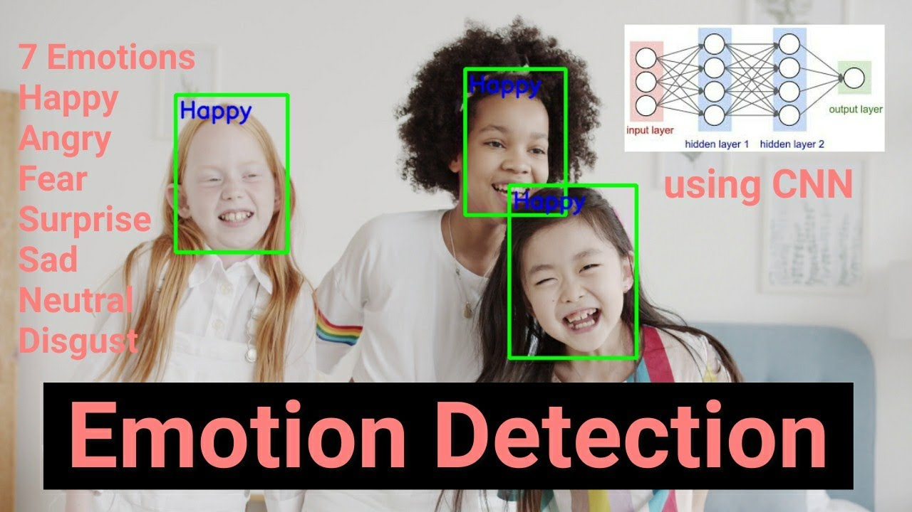

## Emotion Detection from Image using CNN (VGG-16)




## Table of Contents
- [Introduction](#introduction)
- [Model Architecture](#model-architecture)
- [Dataset](#dataset)
- [Requirements](#requirements)
- [Installation](#installation)
- [Usage](#usage)
- [Results](#results)
- [Contributing](#contributing)
- [License](#license)
- [Contact](#contact)

## Introduction

This is a Convolutional Neural Network (CNN) model for Emotion Detection from images using the popular VGG-16 architecture. The model is designed to classify facial expressions into one of seven emotions: Angry, Disgust, Fear, Happy, Sad, Surprise, and Neutral. The emotions are inferred from the input images that are resized to 48x48 grayscale format.

Emotion detection from images has various applications, including human-computer interaction, affective computing, and market research, among others. The VGG-16 CNN architecture has proven to be effective in image classification tasks, making it an excellent choice for this project.

## Model Architecture

The CNN model is implemented using the Keras library with TensorFlow backend. The architecture consists of multiple Convolutional and MaxPooling layers, followed by Dense (fully connected) layers. The final layer uses softmax activation to provide probabilities for each emotion class.

The model summary is as follows:

```
Layer (type)                 Output Shape              Param #
==============================================================
Conv2D (Conv2D)              (None, 46, 46, 32)        320
______________________________________________________________
BatchNormalization (BatchNor (None, 46, 46, 32)        128
______________________________________________________________
MaxPooling2D (MaxPooling2D)  (None, 23, 23, 32)        0
______________________________________________________________
Conv2D_1 (Conv2D)            (None, 21, 21, 64)        18496
______________________________________________________________
BatchNormalization_1 (BatchN (None, 21, 21, 64)        256
______________________________________________________________
MaxPooling2D_1 (MaxPooling2D (None, 10, 10, 64)        0
______________________________________________________________
Conv2D_2 (Conv2D)            (None, 8, 8, 128)         73856
______________________________________________________________
BatchNormalization_2 (BatchN (None, 8, 8, 128)         512
______________________________________________________________
MaxPooling2D_2 (MaxPooling2D (None, 4, 4, 128)         0
______________________________________________________________
Flatten (Flatten)            (None, 2048)              0
______________________________________________________________
Dense (Dense)                (None, 1024)              2098176
______________________________________________________________
Dropout (Dropout)            (None, 1024)              0
______________________________________________________________
Dense_1 (Dense)              (None, 7)                 7175
==============================================================
Total params: 2,198,919
Trainable params: 2,198,471
Non-trainable params: 448
```

## Dataset

For training and evaluating the model, a dataset of facial expression images is required. You can use well-known datasets such as FER2013 or CK+ for emotion recognition. The images should be preprocessed and resized to the input shape of the model (48x48 grayscale).

## Requirements

To run this project, you need the following dependencies:

- Python (>=3.6)
- TensorFlow (>=2.0)
- Keras (>=2.4)

## Installation

1. Clone this repository: `https://github.com/73-sk-nahid/FaceImage_Emotion_Detection.git`
2. Navigate to the project directory: `cd FaceImage_Emotion_Detection`
3. Install the required packages: `pip install -r requirements.txt`

## Usage

1. Prepare your dataset by organizing it into appropriate directories.
2. Make sure the dataset is preprocessed and resized to 48x48 grayscale images.
3. Modify the paths in the code to point to your dataset.
4. Train the model using `python train.py`.
5. Evaluate the model using `python evaluate.py`.
6. Use the trained model for inference in your applications.

## Results

The model's performance on the test set and other evaluation metrics will be displayed after running `evaluate.py`. You can fine-tune the model or try different hyperparameters to improve performance.

## Contributing

If you want to contribute to this project, feel free to submit pull requests. Your contributions are highly appreciated!

## License

This project is licensed under the MIT License - see the [LICENSE](LICENSE.txt) file for details.

## Contact

If you have any questions or suggestions, please feel free to contact me at [Here](mailto:nahidsheikh2001@gmail.com). Happy coding!
